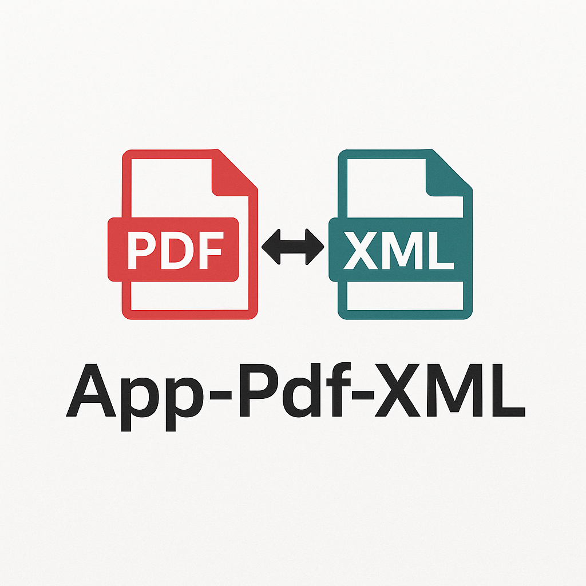

<p align="center">
  
</p>

# 🧾 App-Pdf-XML


**App-Pdf-XML** es una aplicación de escritorio desarrollada en Python que permite convertir documentos PDF del SII a XML estructurado y viceversa. Ideal para contadores, empresas y usuarios que necesitan manejar documentos tributarios en formato digital de forma automatizada.

---

## 🎥 Demo


---

## 🚀 Características

- ✅ Conversión de PDFs a XML estructurado.
- ✅ Generación de PDFs con formato a partir de XML.
- ✅ Compatible con archivos del Servicio de Impuestos Internos (SII) de Chile.
- ✅ Interfaz intuitiva y ligera.
- ✅ Generación automática de ejecutable `.exe` para Windows con GitHub Actions.

---

## 📦 Instalación (modo desarrollo)

1. Clona el repositorio:
   ```bash
   git clone https://github.com/Geowar17/App-Pdf-XML.git
   cd App-Pdf-XML

2. Crea y activa un entorno virtual:
    python -m venv env
    source env/bin/activate  # En Mac/Linux
    env\Scripts\activate     # En Windows

3. Instala dependencias:
    pip install -r requirements.txt

4.Ejecuta la app:
    python inicio.py


🛠 Generar .exe con GitHub Actions
    El proyecto incluye un workflow automático para generar un ejecutable de Windows cada vez que haces push a main.

    Resultado:
    Puedes descargar el archivo .exe desde la pestaña Actions > Build EXE > Artifacts.


📁 Estructura del proyecto
        App-Pdf-XML/
    ├── inicio.py               # Script principal
    ├── requirements.txt        # Dependencias
    ├── README.md               # Este archivo
    ├── .github/
    │   └── workflows/
    │       └── build.yml       # CI para generar .exe
    └── ...otros archivos...


💡 Tecnologías
    Python 3.10+

    pdfplumber

    PyPDFium2

    ReportLab

    PyInstaller

👨‍💻 Autor
    Geovanny Lucena – @Geowar17

📄 Licencia
    Este proyecto está bajo la licencia MIT. Consulta el archivo LICENSE para más detalles.